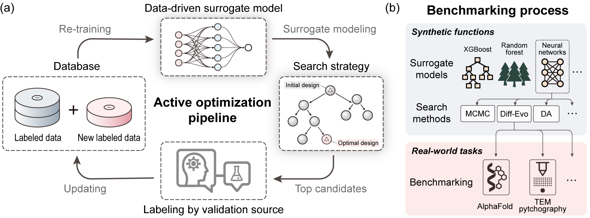

# BAOSA: Benchmarking Active Optimization for Self-driving lAboratories

`BAOSA` is a comprehensive benchmark suite for evaluating active optimisation algorithms in real-world scientific design tasks, with a focus on materials science and biology. The suite provides standardised implementations, metrics, and evaluation protocols to enable systematic comparison of different approaches.

<p align="center">
  
</p>

## Key Features

- **Real-world Scientific Tasks**: Includes challenging tasks from electron ptychography and protein design
- **Synthetic Benchmark Functions**: Standard test functions with known properties and varying difficulty
- **Standardised Evaluation**: Consistent protocols for fair algorithm comparison
- **Active Optimisation Framework**: Easy integration of new tasks and algorithms
- **Comprehensive Baselines**: Implementation of 10+ state-of-the-art optimisation methods

## Benchmark Results

### Parameter Optimisation: Electron Ptychography Reconstruction
Comparison of reconstructed phases (object transmission functions) obtained using different derivative-free optimisation methods on a MoS₂ dataset. Results demonstrate the relative performance of various approaches in this high-dimensional (14D) optimisation task.
<p align="center">
  
</p>

### Protein Design: Cyclic Peptide
Performance comparison of different optimisation strategies for designing cyclic peptide binders, showing the peptide sequences and corresponding protein interaction maps for target protein 4kel.
<p align="center">
  
</p>

### Synthetic Function Benchmarks
Quantitative comparison across standard test functions. Results show mean ± standard deviation over 5 independent trials.
<p align="center">
  
</p>

## Installation

### Requirements
- Python ≥ 3.12
- CUDA-enabled GPU (recommended)
- TensorFlow and Keras with GPU support

### Quick Start (Basic Installation)
For most users, the basic installation is sufficient:
```bash
pip install uv
uv venv .venv --python 3.12 
source .venv/bin/activate
uv pip install -e .
```

### Developer Installation
If you plan to contribute or need additional development tools:
```bash
git clone https://github.com/poyentung/balsa.git
cd balsa

pip install uv
uv venv .venv --python 3.12
source .venv/bin/activate
uv pip install -e ".[dev]"
```
Note: If you want to test cyclic peptide design, make sure you have ColabDesign and PyRosetta installed.

Refer to https://github.com/sokrypton/ColabDesign/tree/main/af for ColabDesign.

Refer to https://www.pyrosetta.org/downloads for PyRosetta.
### Verify Installation
Run the test suite to ensure everything is working correctly:

```bash
# Basic tests (recommended for most users)
python -m pytest -m "not slow and not dev"

# Extended tests (for developers)
python -m pytest -m "not slow"

# Full test suite (for developers)
python -m pytest
```

Note: The basic test suite is sufficient for most users. Extended and full tests are primarily for development purposes and may take longer to complete.

## Usage Examples

### Real-world Task: Electron Ptychography
This example demonstrates how to optimise parameters for electron ptychography reconstruction using the `TuRBO` algorithm. The task involves:
- Optimising 14 reconstruction parameters for the MoS₂ dataset
- Using a sequential acquisition strategy with 20 iterations (1 new sample per iteration)
- Starting with 30 initial random samples

```bash
python scripts/run_ptycho.py search_method=turbo \
                             obj_func_name=ptycho \
                             dims=14 \
                             num_acquisitions=50 \
                             num_samples_per_acquisition=1 \
                             num_init_samples=30
```

Note: For `TuRBO` and `LaMCTS` algorithms, the total number of samples (`num_acquisitions × num_samples_per_acquisition`) represents the complete budget including initial samples. The total number of new samples should be `num_acquisitions × num_samples_per_acquisition - num_init_samples` (`30 - 20`).

### Synthetic Benchmark: Multi-algorithm Comparison
This example shows how to benchmark multiple optimisation algorithms on the `Ackley` function, a standard test problem with a pre-defined surrogate model:
- Compares MCMC, CMA-ES, and Dual Annealing approaches
- Optimises in 10 dimensions
- Uses 50 initial random samples
- Performs 10 acquisition iterations
- Collects 20 samples per iteration (200 total evaluations)

```bash
python scripts/run.py -m search_method=mcmc,cmaes,da \
                         obj_func_name=ackley \
                         dims=10 \
                         num_acquisitions=100 \
                         num_samples_per_acquisition=20 \
                         num_init_samples=50
```

Results will be saved in the `results` directory, including performance metrics and optimisation trajectories for each algorithm.

## Tutorials

We provide detailed tutorials to help you get started with BALSA:

1. [Adding Custom Functions](docs/tutorials/01_creating_custom_functions.md) - Learn how to create and integrate your own optimisation functions
2. [Custom Function Configuration](docs/tutorials/02_function_configuration.md) - Detailed guide on configuring and running custom functions
3. [Jupyter notebook](docs/tutorials/tutorial_creating_custon_functions.ipynb) - Jupyter notebook version of the custom function tutorial
## Creating a Custom Objective Function

For a quick start, here's a basic example of creating a custom function. For detailed instructions, see our [Custom Functions Tutorial](docs/tutorials/01_creating_custom_functions.md).

```python
@dataclass
class CustomObjectiveFunction(ObjectiveFunction):
    """Custom objective function for optimisation."""
    name: str = "custom_objective"
    turn: float = 0.1  # Controls input discretisation granularity

    def __post_init__(self):
        super().__post_init__()
        # Define problem bounds
        self.lb = -5 * np.ones(self.dims)  # Lower bounds
        self.ub = 5 * np.ones(self.dims)   # Upper bounds

    @override
    def _scaled(self, y: float) -> float:
        """Scale objective value for surrogate fitting."""
        return 1 / (y + 0.01)  # For minimisation problems
        # return -1 * y  # For maximisation problems

    @override
    def __call__(self, x: NDArray, saver: bool = True, return_scaled: bool = False) -> float:
        """Compute objective value for given input."""
        x = np.array(x / self.turn).round(0) * self.turn  # Discretise input values
        self.counter += 1
        
        y = float(your_objective_function(x))  # Your function here
        
        self.tracker.track(y, x, saver)
        return y if not return_scaled else self._scaled(y)
```

### Tips:
- Set appropriate bounds (`lb`, `ub`) for your problem
- Choose scaling based on whether you're minimising or maximising
- Use `self.tracker` to log evaluations
- The `turn` parameter controls input discretisation:
  - `turn = 0.1`: Rounds inputs to nearest 0.1 (e.g., 1.23 → 1.2)
  - `turn = 1.0`: Rounds to integers
  - Smaller values allow finer granularity but increase search space

## Supported Tasks

### Real-world Scientific Tasks
- **Electron Ptychography**: 14-dimensional parameter optimisation for microscopy reconstruction
- **Cyclic Peptide Design**: Protein engineering for targeted binding

### Synthetic Benchmark Functions
- Ackley
- Rastrigin
- Rosenbrock
- Schwefel
- Michalewicz
- Griewank

## Implemented Algorithms
- [TuRBO](https://github.com/uber-research/TuRBO)
- [LaMCTS](https://github.com/facebookresearch/LaMCTS)
- [Dual Annealing](https://docs.scipy.org/doc/scipy/reference/generated/scipy.optimize.dual_annealing.html)
- [Differential Evolution](https://docs.scipy.org/doc/scipy/reference/generated/scipy.optimize.differential_evolution.html)
- [CMA-ES](https://github.com/CMA-ES/pycma)
- MCMC
- [DOO](https://github.com/beomjoonkim/voot)
- [SOO](https://github.com/beomjoonkim/voot)
- [VOO](https://github.com/beomjoonkim/voot)

## Contributing

We welcome contributions! Please submit a PR to:
- Add new scientific tasks
- Implement additional algorithms
- Improve documentation
- Fix bugs

## License

This project is licensed under the MIT License - see the [LICENSE](LICENSE) file for details.
